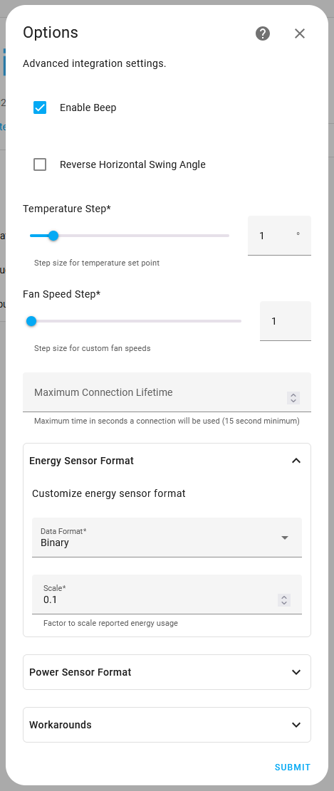

# Midea Smart AC
[](https://github.com/mill1000/midea-ac-py/actions/workflows/checks.yml)
[](https://github.com/mill1000/midea-ac-py/actions/workflows/hassfest.yml)
[](https://github.com/mill1000/midea-ac-py/actions/workflows/hacs.yml)
[](https://github.com/hacs/integration)

Home Assistant custom integration to control Midea (and associated brands) air conditioners via LAN.

Midea is an OEM for many brands including:
AirCon, Alpine Home Air, Artel, Beko, Canair, Carrier, Century, Comfee, Electrolux, Friedrich, Galactic, Goodman, Hualing, Idea, Inventor, Kaisai, Kenmore, Klimaire, Lennox, LG, Mitsui, Mr. Cool, Neoclima, Olimpia Splendid, Pioneer, Pridiom, QLIMA, Qzen, Rotenso, Royal Clima, Samsung, Senville, Thermocore, Toshiba, Trane and more.

A device is likely supported if it uses one of the following Android apps or it's iOS equivalent.
* Artic King (com.arcticking.ac)
* Midea Air (com.midea.aircondition.obm)
* NetHome Plus (com.midea.aircondition)
* SmartHome/MSmartHome (com.midea.ai.overseas)
* Toshiba AC NA (com.midea.toshiba)
* 美的美居 (com.midea.ai.appliances)

__Note: Only air conditioner devices (type 0xAC) are supported.__ 

See [Getting Device Info](#getting-device-info) to determine if a device is supported.


## Features
* Automatic device discovery and configuration via the GUI.
* Device capability detection. Only supported functions are displayed.
* Support for sleep, eco, boost (turbo), and away (freeze protection) presets.
* Minimum and maximum target temperatures provided by the device.
* Switch for device display<sup>1</sup>.
* Advanced controls (when supported by the device):
  * Purifier (Ionizer/UV)
  * Device filter alert
  * Custom fan speeds
  * Service to enable the "Follow Me" function<sup>2</sup>
  * Swing angle (fan position)
  * Indoor humidity sensor
  * Target humidity in Dry mode
  * Energy and power sensors<sup>3</sup>
  * Start and monitor self-cleaning
  * Rate selection (Gear mode)
  * "Breeze" modes (e.g., breeze away, breeze mild, breezeless)
  * iECO
  * Auxiliary heating mode
  * Flash/jet cool

<small>

1. Device dependent. Some devices only support display control via IR.
2. Experimental. "Follow Me" requires the IR remote to transmit temperature data. More info [here](https://github.com/mill1000/midea-msmart/pull/91).
3. Sensors must be manually enabled on the device page. A device may not support all energy sensors.
</small>

## Translations
Thanks to the community the integration is available in the following languages.
  * български
  * Català
  * Čeština
  * 简体中文
  * 繁體中文
  * Deutsch
  * English
  * Español
  * Euskara
  * Français
  * Hrvatski
  * Italiano
  * 한국어
  * Magyar
  * Nederlands
  * Norsk (bokmål)
  * Polski
  * Português
  * Română
  * Pусский
  * Slovenčina
  * Slovenski
  * Türkçe
  * українська
  * [Help contribute a new language](https://github.com/mill1000/midea-ac-py/issues/54)

## Install Via HACS
[](https://my.home-assistant.io/redirect/hacs_repository/?owner=mill1000&repository=midea-ac-py&category=integrations)

Or search HACS integrations for "Midea Smart AC".

## Install Manually
1. Locate the `custom_components` directory in your Home Assistant configuration directory. It may need to be created.
2. Copy the `custom_components/midea_ac` directory into the `custom_components` directory.
3. Restart Home Assistant.

## Configuration
Midea Smart AC is configured via the GUI. See [the HA docs](https://www.home-assistant.io/getting-started/integration/) for more details.

Click the _Add Integration_ button and search for "Midea Smart AC".


Devices can be automatically discovered and configured or manually configured.

### Automatic Configuration
For automatic configuration, select "Discover devices". 

Enter a hostname or IP address to configure a specific device, or leave it blank to search the local network.

Depending on your location, a different cloud region may be necessary to authenticate V3 devices. Try selecting the closest country to your location if you experience issues.


### Manual Configuration
For manual configuration, select "Configure manually". 

Enter the device ID, IP, and port. V3 devices require the token and key parameter. This information must be [acquired manually](#getting-device-info).


---
Name | Description | Required | Example 
:--- | :--- | :--- | :---
**ID** | Device ID | Yes | 123456789012345
**Host** | Device IP address | Yes | 192.168.1.100
**Port** | Device port | Yes | 6444
**Token** | Device token | For V3 devices | ACEDDA53831AE5DC... (128 character hexadecimal string)
**Key** | Device key | For V3 devices | CFFA10FC... (64 character hexadecimal string)

## Integration Options
Additional options are available to tweak integration behavior per device.



---
Name | Default | Description 
:--- | :--- | :--- 
**Beep** | True | Enable beep on setting changes.
**Reverse Horizontal Swing Angle** | False | Reverse the order of horizontal swing angles from left-to-right to right-to-left.
**Temperature Step** | 1.0 | Step size for temperature set point.
**Fan Speed Step** | 1 | Step size for custom fan speeds.
**Maximum Connection Lifetime** | Empty | Limit the time (in seconds) a connection to the device will be used before reconnecting. If left blank, the connection will persist indefinitely. If your device disconnects at regular intervals, set this to a value below the interval.
**Energy Sensor Format > Data Format** | BCD | Select the data format for decoding energy data from the device.
**Energy Sensor Format > Scale** | 1.0 | Select the data scale for reporting energy data from the device.
**Power Sensor Format > Data Format** | BCD | Select the data format for decoding power data from the device.
**Power Sensor Format > Scale** | 1.0 | Select the data scale for reporting power data from the device.
**Workarounds > Use Fan-only Workaround** | False | Enable this option if device updates cause the device to turn on and switch to fan-only.
**Workarounds > Show All Presets** | False | Show all presets regardless of device's reported capabilities.
**Workarounds > Additional Operation Modes** | Empty | Additional HVAC modes to make available in case the device's capabilities are incorrect.


## Resolving Connectivity Issues
Some users have reported issue with their devices periodically becoming unavailable, and with logs full of warnings and errors. This is almost always due to the device terminating the existing connection and briefly rejecting new connections. 

It can usually be resolved by setting the `Maximum Connection Lifetime` to a value of about 90 seconds.

## Getting Device Info
Use [msmart-ng](https://github.com/mill1000/midea-msmart) to obtain device information.
```shell
pip install msmart-ng
msmart-ng discover
```
Check the output to ensure the type is 0xAC and the `supported` property is True.

## Gratitude
This project is a fork of [mac-zhou/midea-ac-py](https://github.com/mac-zhou/midea-ac-py), and builds upon the work of:
* [NeoAcheron/midea-ac-py](https://github.com/NeoAcheron/midea-ac-py)
* [andersonshatch/midea-ac-py](https://github.com/andersonshatch/midea-ac-py)
* [yitsushi/midea-air-condition](https://github.com/yitsushi/midea-air-condition)
